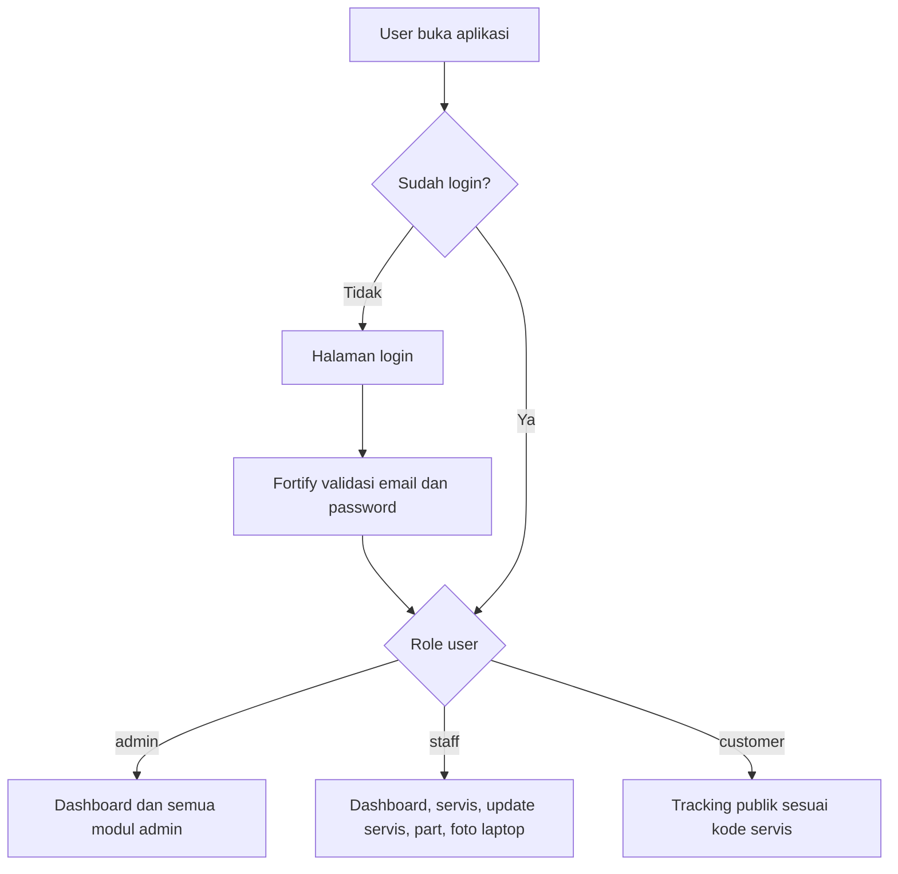
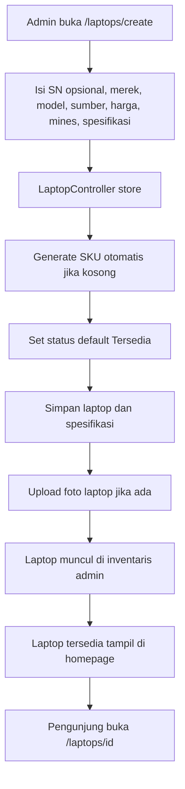
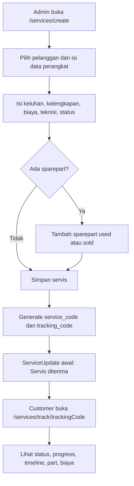
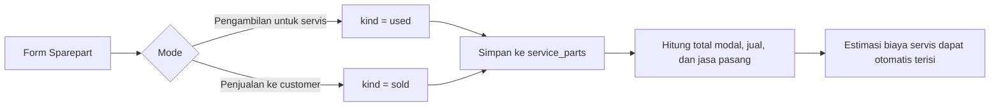
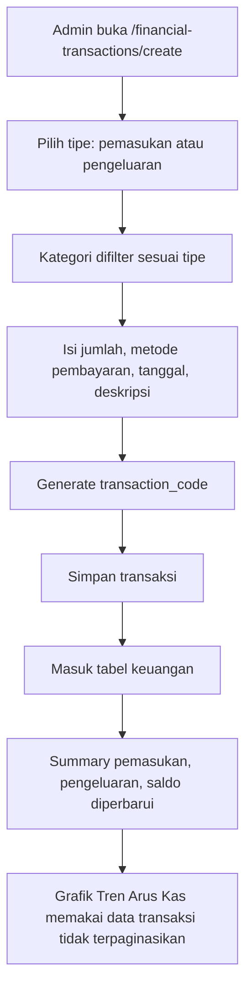
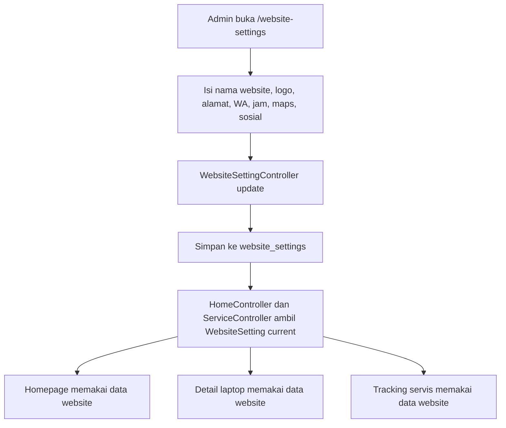
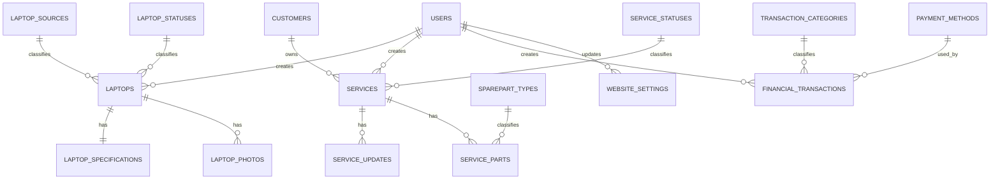

# Pabalu Laptop

Pabalu Laptop adalah aplikasi manajemen operasional toko laptop dan jasa servis. Aplikasi ini mencakup inventaris laptop, servis dan sparepart, pelanggan, transaksi keuangan, master data, pengaturan website, dashboard admin, pencarian global, serta halaman publik untuk katalog laptop dan tracking servis.

Repository: `https://github.com/radacore/pabalu-laptop-bullah`

## Database

Project ini memakai **MySQL penuh**, termasuk untuk development lokal.

Database default:

```env
DB_CONNECTION=mysql
DB_HOST=127.0.0.1
DB_PORT=3306
DB_DATABASE=db_pabalu_laptop
DB_USERNAME=root
DB_PASSWORD=
```

Sebelum menjalankan migrasi, buat database lokal:

```sql
CREATE DATABASE db_pabalu_laptop CHARACTER SET utf8mb4 COLLATE utf8mb4_unicode_ci;
```

Jika password MySQL lokal berbeda, sesuaikan `DB_USERNAME` dan `DB_PASSWORD` di `.env`.

## Ringkasan Fitur

### Admin Panel

- Dashboard KPI untuk ringkasan operasional.
- Grafik tren penjualan dan servis.
- Daftar laptop terbaru dan servis terbaru.
- Pencarian global untuk laptop, servis, dan pelanggan.
- Sidebar admin dengan navigasi modul utama.

### Inventaris Laptop

- CRUD data laptop.
- SKU otomatis dengan format `PBL-{tanggal}-{random}`.
- Field utama: SN opsional, merek, model, sumber, tanggal pembelian, harga pengambilan, harga jual, ongkos jadi, keterangan minus, dan spesifikasi bebas.
- Status laptop otomatis menggunakan status tersedia saat laptop dibuat.
- Upload foto laptop.
- Halaman detail publik untuk setiap laptop.

### Servis dan Sparepart

- CRUD servis dengan kode otomatis `SRV-{tanggal}-{random}`.
- Tracking publik memakai `tracking_code`.
- Field perangkat: merek, model, kelengkapan, keluhan, kondisi awal, estimasi biaya, teknisi, status servis.
- Timeline update servis.
- Sparepart dinamis dengan 2 mode:
  - Pengambilan untuk servis (`used`).
  - Penjualan ke customer (`sold`).
- Estimasi biaya dapat dihitung dari total sparepart.
- Halaman tracking publik dengan progress 5 tahap: diterima, diagnosis, perbaikan, QC, siap diambil.

### Pelanggan

- CRUD pelanggan.
- Pencarian berdasarkan nama dan nomor telepon.
- Relasi pelanggan ke data servis.

### Keuangan

- CRUD transaksi pemasukan dan pengeluaran.
- Kode transaksi otomatis `TXN-{tanggal}-{random}`.
- Kategori transaksi berdasarkan tipe pemasukan atau pengeluaran.
- Ringkasan pemasukan, pengeluaran, dan saldo.
- Grafik tren arus kas dari data transaksi tidak terpaginasikan.
- Breakdown kategori transaksi.
- Filter pencarian, tipe, kategori, dan rentang tanggal.
- Ekspor CSV untuk transaksi yang sedang ditampilkan.

### Master Data

Master data digunakan untuk mengatur pilihan di modul lain:

- Merek.
- Kategori.
- Sumber laptop.
- Status laptop.
- Status servis.
- Tipe sparepart.
- Metode pembayaran.
- Kategori transaksi.

Halaman master data dikelompokkan menjadi grup inventaris, servis, dan keuangan.

### Pengaturan Website

Admin dapat mengatur data website dari panel `/website-settings`:

- Nama website.
- Tagline.
- Logo website.
- Alamat.
- Nomor WhatsApp.
- Nomor telepon.
- Email.
- Jam operasional hari kerja.
- Jam operasional akhir pekan.
- Google Maps embed.
- Deskripsi footer.
- Link sosial media: Facebook, Instagram, YouTube, dan TikTok.

Data ini dipakai oleh halaman publik agar konten website dapat diubah dari admin tanpa mengedit kode.

### Halaman Publik

Halaman publik memakai gaya visual Precision Tech System, terpisah dari gaya admin.

- Homepage `/`.
- Detail laptop `/laptops/{laptop}`.
- Tracking servis `/services/track/{trackingCode}`.

Homepage mengambil data laptop tersedia, testimoni aktif, dan pengaturan website dari database.

## Flow Penting

### Flow akses aplikasi



### Flow input laptop sampai tampil publik



### Flow servis dan tracking publik



### Flow sparepart servis



### Flow transaksi keuangan



### Flow pengaturan website ke halaman publik



### Relasi data utama



## Role Pengguna

Aplikasi memakai role sederhana:

| Role | Akses |
| --- | --- |
| `admin` | Akses penuh ke semua modul admin. |
| `staff` | Dashboard, servis, service update, service part, dan foto laptop. |
| `customer` | Tracking publik sesuai kebutuhan aplikasi. |

Proteksi route menggunakan middleware `EnsureUserHasRole`.

## Teknologi

### Backend

- PHP `^8.3`.
- Laravel `^13.7`.
- Laravel Fortify `^1.37.2`.
- MySQL untuk development lokal dan production.
- Pest PHP `^4.7`.

### Frontend

- Inertia React `^3.0.0`.
- React `^19.2.0`.
- TypeScript `^5.7.2`.
- Tailwind CSS `^4.0.0`.
- shadcn/ui untuk komponen admin.
- lucide-react untuk ikon aplikasi.
- Material Symbols Outlined untuk ikon sidebar.

### Tooling

- Vite.
- Laravel Wayfinder untuk route helper frontend.
- Composer.
- NPM.

## Struktur Modul Penting

```text
app/Http/Controllers/
  CustomerController.php
  DashboardController.php
  FinancialTransactionController.php
  HomeController.php
  LaptopController.php
  SearchController.php
  ServiceController.php
  WebsiteSettingController.php
  MasterData/

app/Models/
  Laptop.php
  Service.php
  ServicePart.php
  Customer.php
  FinancialTransaction.php
  WebsiteSetting.php
  Testimonial.php

resources/js/pages/
  dashboard.tsx
  welcome.tsx
  search.tsx
  laptops/
  services/
  customers/
  financial-transactions/
  master-data/
  admin/website-settings.tsx
  public/laptop-detail.tsx
```

## Alur Penggunaan Admin

### 1. Login

Masuk melalui:

```text
/login
```

Akun development bawaan dari seeder:

```text
Email: admin@pabalu.com
Password: password
```

### 2. Lengkapi Master Data

Sebelum input transaksi operasional, pastikan master data sudah tersedia:

- Merek.
- Sumber laptop.
- Status laptop.
- Status servis.
- Tipe sparepart.
- Metode pembayaran.
- Kategori transaksi.

Seeder sudah menyediakan data awal untuk kebutuhan development.

### 3. Atur Website

Buka:

```text
/website-settings
```

Isi nama website, alamat, nomor WA, jam operasional, Google Maps embed, logo, dan footer. Data ini akan muncul di homepage, detail laptop, dan tracking servis.

### 4. Input Laptop

Buka:

```text
/laptops/create
```

Isi data unit laptop. Status laptop akan otomatis diarahkan ke status tersedia jika status tidak dikirim dari form.

### 5. Input Servis

Buka:

```text
/services/create
```

Pilih pelanggan, isi informasi perangkat, keluhan, kelengkapan, status, teknisi, dan sparepart jika ada. Sparepart bisa dicatat sebagai pengambilan untuk servis atau penjualan ke customer.

### 6. Input Transaksi Keuangan

Buka:

```text
/financial-transactions/create
```

Pilih tipe pemasukan atau pengeluaran. Kategori akan menyesuaikan tipe transaksi. Setelah tersimpan, transaksi muncul di halaman keuangan dan ikut dihitung dalam ringkasan serta grafik arus kas.

### 7. Pantau Dashboard

Buka:

```text
/dashboard
```

Dashboard menampilkan KPI, tren, data terbaru, dan daftar yang perlu perhatian.

## Alur Halaman Publik

### Homepage

```text
/
```

Menampilkan hero, pencarian status servis, laptop pilihan, layanan, testimoni, kontak, Google Maps, dan footer.

### Detail Laptop

```text
/laptops/{id}
```

Menampilkan foto, spesifikasi, harga, status, CTA WhatsApp, dan produk terkait.

### Tracking Servis

```text
/services/track/{trackingCode}
```

Menampilkan status servis, progress 5 tahap, timeline update, sparepart, estimasi biaya, dan tombol WhatsApp.

## Instalasi Lokal

Clone repository:

```bash
git clone https://github.com/radacore/pabalu-laptop-bullah.git
cd pabalu-laptop-bullah
```

Install dependency PHP:

```bash
composer install
```

Install dependency frontend:

```bash
npm install
```

Buat file environment:

```bash
cp .env.example .env
php artisan key:generate
```

Buat database MySQL lokal:

```sql
CREATE DATABASE db_pabalu_laptop CHARACTER SET utf8mb4 COLLATE utf8mb4_unicode_ci;
```

Pastikan konfigurasi database di `.env` memakai MySQL:

```env
DB_CONNECTION=mysql
DB_HOST=127.0.0.1
DB_PORT=3306
DB_DATABASE=db_pabalu_laptop
DB_USERNAME=root
DB_PASSWORD=
```

Jalankan migrasi dan seeder:

```bash
php artisan migrate --seed
```

Jalankan symbolic link storage untuk upload logo dan foto:

```bash
php artisan storage:link
```

Jalankan server Laravel:

```bash
php artisan serve
```

Jalankan Vite:

```bash
npm run dev
```

Akses aplikasi:

```text
http://127.0.0.1:8000
```

## Perintah Development

Format kode frontend:

```bash
npm run format
```

Lint frontend:

```bash
npm run lint
```

Build frontend:

```bash
npm run build
```

Test backend:

```bash
php artisan test
```

## Catatan Repository

Folder berikut tidak dilacak oleh Git karena hanya artefak lokal/tooling:

- `.playwright-mcp/`
- `.sisyphus/`
- `vendor/`
- `node_modules/`
- `public/build/`
- `public/storage/`
- `.env`

## Status

Aplikasi sudah mencakup alur utama toko laptop dan servis:

1. Admin login.
2. Admin mengelola master data.
3. Admin mengatur konten website.
4. Admin input laptop dan foto.
5. Admin input servis, sparepart, dan update timeline.
6. Admin input transaksi keuangan.
7. Dashboard dan grafik membaca data operasional.
8. Customer dapat melihat homepage, detail laptop, dan tracking servis publik.
