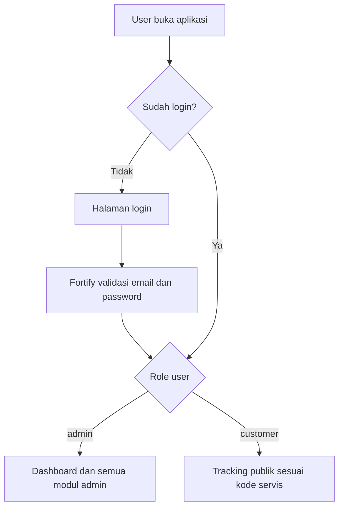
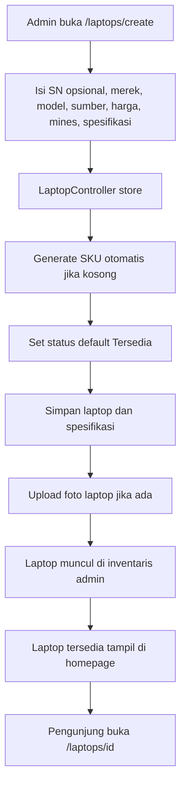
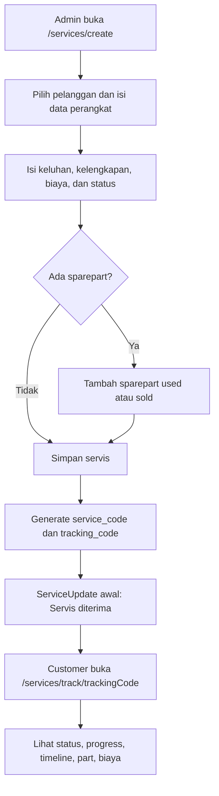
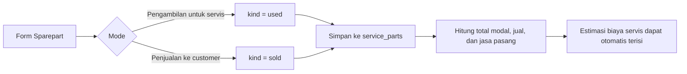
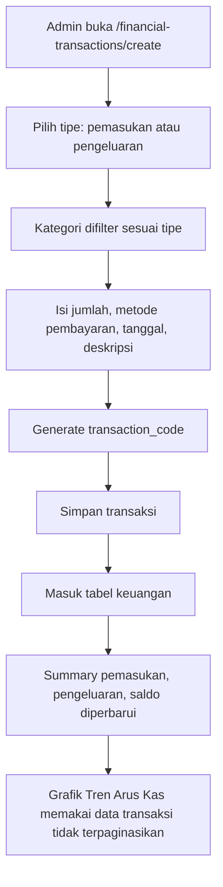
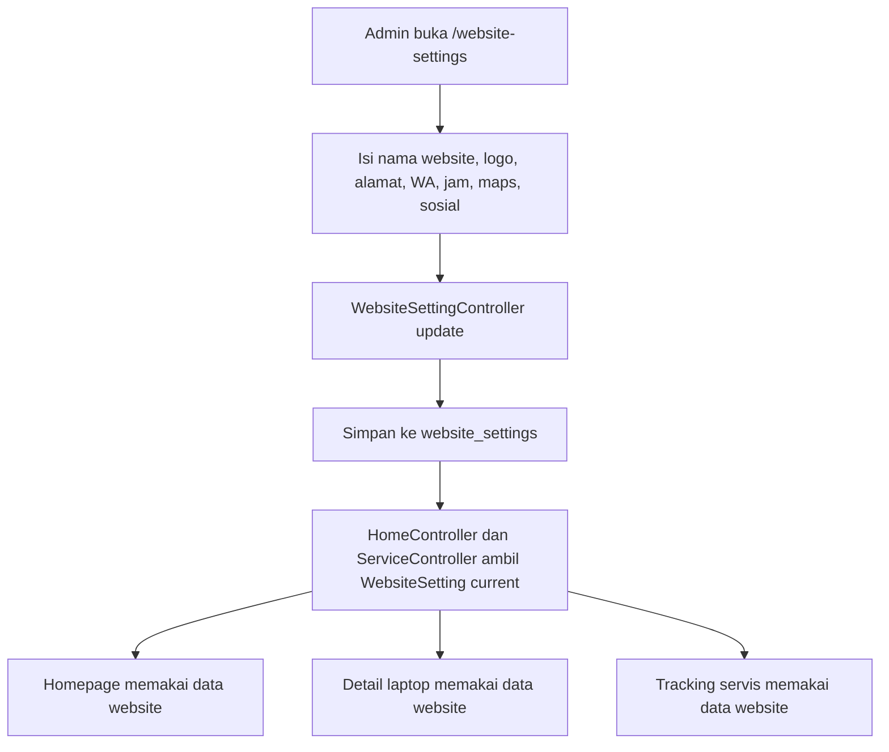
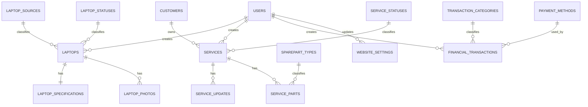

# Pabalu Laptop

Pabalu Laptop adalah aplikasi manajemen operasional toko laptop dan jasa servis. Aplikasi ini mencakup inventaris laptop, servis dan sparepart, pelanggan, transaksi keuangan, master data, pengaturan website, dashboard admin, pencarian global, serta halaman publik untuk katalog laptop dan tracking servis.

Repository: `https://github.com/radacore/pabalu-laptop-bullah`

## Database

Project ini memakai **MySQL penuh**, termasuk untuk development lokal.

Database default:

```env
DB_CONNECTION=mysql
DB_HOST=127.0.0.1
DB_PORT=3306
DB_DATABASE=db_pabalu_laptop
DB_USERNAME=root
DB_PASSWORD=
```

Sebelum menjalankan migrasi, buat database lokal:

```sql
CREATE DATABASE db_pabalu_laptop CHARACTER SET utf8mb4 COLLATE utf8mb4_unicode_ci;
```

Jika password MySQL lokal berbeda, sesuaikan `DB_USERNAME` dan `DB_PASSWORD` di `.env`.

## Ringkasan Fitur

### Admin Panel

- Dashboard KPI untuk ringkasan operasional.
- Grafik tren penjualan dan servis.
- Daftar laptop terbaru dan servis terbaru.
- Pencarian global untuk laptop, servis, dan pelanggan.
- Sidebar admin dengan navigasi modul utama.

### Inventaris Laptop

- CRUD data laptop.
- SKU otomatis dengan format `PBL-{tanggal}-{random}`.
- Field utama: SN opsional, merek, model, sumber, tanggal pembelian, harga pengambilan, harga jual, ongkos jadi, keterangan minus, dan spesifikasi bebas.
- Status laptop otomatis menggunakan status tersedia saat laptop dibuat.
- Upload foto laptop.
- Halaman detail publik untuk setiap laptop.

### Servis dan Sparepart

- CRUD servis dengan kode otomatis `SRV-{tanggal}-{random}`.
- Tracking publik memakai `tracking_code`.
- Field perangkat: merek, model, kelengkapan, keluhan, kondisi awal, estimasi biaya, dan status servis.
- Timeline update servis.
- Sparepart dinamis dengan 2 mode:
  - Pengambilan untuk servis (`used`).
  - Penjualan ke customer (`sold`).
- Estimasi biaya dapat dihitung dari total sparepart.
- Halaman tracking publik dengan progress 5 tahap: diterima, diagnosis, perbaikan, QC, siap diambil.

### Pelanggan

- CRUD pelanggan.
- Pencarian berdasarkan nama dan nomor telepon.
- Relasi pelanggan ke data servis.

### Keuangan

- CRUD transaksi pemasukan dan pengeluaran.
- Kode transaksi otomatis `TXN-{tanggal}-{random}`.
- Kategori transaksi berdasarkan tipe pemasukan atau pengeluaran.
- Ringkasan pemasukan, pengeluaran, dan saldo.
- Grafik tren arus kas dari data transaksi tidak terpaginasikan.
- Breakdown kategori transaksi.
- Filter pencarian, tipe, kategori, dan rentang tanggal.
- Ekspor CSV untuk transaksi yang sedang ditampilkan.

### Master Data

Master data digunakan untuk mengatur pilihan di modul lain:

- Merek.
- Kategori.
- Sumber laptop.
- Status laptop.
- Status servis.
- Tipe sparepart.
- Metode pembayaran.
- Kategori transaksi.

Halaman master data dikelompokkan menjadi grup inventaris, servis, dan keuangan.

### Pengaturan Website

Admin dapat mengatur data website dari panel `/website-settings`:

- Nama website.
- Tagline.
- Logo website.
- Alamat.
- Nomor WhatsApp.
- Nomor telepon.
- Email.
- Jam operasional hari kerja.
- Jam operasional akhir pekan.
- Google Maps embed.
- Deskripsi footer.
- Link sosial media: Facebook, Instagram, YouTube, dan TikTok.

Data ini dipakai oleh halaman publik agar konten website dapat diubah dari admin tanpa mengedit kode.

### Halaman Publik

Halaman publik memakai gaya visual Precision Tech System, terpisah dari gaya admin.

- Homepage `/`.
- Detail laptop `/laptops/{laptop}`.
- Tracking servis `/services/track/{trackingCode}`.

Homepage mengambil data laptop tersedia, testimoni aktif, dan pengaturan website dari database.

## Flow Penting

### Flow akses aplikasi


```mermaid
flowchart TD
    A[User buka aplikasi] --> B{Sudah login?}
    B -- Tidak --> C[Halaman login]
    C --> D[Fortify validasi email dan password]
    D --> E{Role user}
    B -- Ya --> E
    E -- admin --> F[Dashboard dan semua modul admin]
    E -- customer --> H[Tracking publik sesuai kode servis]
```

### Flow input laptop sampai tampil publik


```mermaid
flowchart TD
    A[Admin buka /laptops/create] --> B[Isi SN opsional, merek, model, sumber, harga, mines, spesifikasi]
    B --> C[LaptopController store]
    C --> D[Generate SKU otomatis jika kosong]
    D --> E[Set status default Tersedia]
    E --> F[Simpan laptop dan spesifikasi]
    F --> G[Upload foto laptop jika ada]
    G --> H[Laptop muncul di inventaris admin]
    H --> I[Laptop tersedia tampil di homepage]
    I --> J[Pengunjung buka /laptops/id]
```

### Flow servis dan tracking publik


```mermaid
flowchart TD
    A[Admin buka /services/create] --> B[Pilih pelanggan dan isi data perangkat]
    B --> C[Isi keluhan, kelengkapan, biaya, dan status]
    C --> D{Ada sparepart?}
    D -- Ya --> E[Tambah sparepart used atau sold]
    D -- Tidak --> F[Simpan servis]
    E --> F
    F --> G[Generate service_code dan tracking_code]
    G --> H[ServiceUpdate awal: Servis diterima]
    H --> I[Customer buka /services/track/trackingCode]
    I --> J[Lihat status, progress, timeline, part, biaya]
```

### Flow sparepart servis


```mermaid
flowchart LR
    A[Form Sparepart] --> B{Mode}
    B -- Pengambilan untuk servis --> C[kind = used]
    B -- Penjualan ke customer --> D[kind = sold]
    C --> E[Simpan ke service_parts]
    D --> E
    E --> F[Hitung total modal, jual, dan jasa pasang]
    F --> G[Estimasi biaya servis dapat otomatis terisi]
```

### Flow transaksi keuangan


```mermaid
flowchart TD
    A[Admin buka /financial-transactions/create] --> B[Pilih tipe: pemasukan atau pengeluaran]
    B --> C[Kategori difilter sesuai tipe]
    C --> D[Isi jumlah, metode pembayaran, tanggal, deskripsi]
    D --> E[Generate transaction_code]
    E --> F[Simpan transaksi]
    F --> G[Masuk tabel keuangan]
    G --> H[Summary pemasukan, pengeluaran, saldo diperbarui]
    H --> I[Grafik Tren Arus Kas memakai data transaksi tidak terpaginasikan]
```

### Flow pengaturan website ke halaman publik


```mermaid
flowchart TD
    A[Admin buka /website-settings] --> B[Isi nama website, logo, alamat, WA, jam, maps, sosial]
    B --> C[WebsiteSettingController update]
    C --> D[Simpan ke website_settings]
    D --> E[HomeController dan ServiceController ambil WebsiteSetting current]
    E --> F[Homepage memakai data website]
    E --> G[Detail laptop memakai data website]
    E --> H[Tracking servis memakai data website]
```

### Relasi data utama


```mermaid
erDiagram
    USERS ||--o{ LAPTOPS : creates
    USERS ||--o{ SERVICES : creates
    CUSTOMERS ||--o{ SERVICES : owns
    LAPTOPS ||--|| LAPTOP_SPECIFICATIONS : has
    LAPTOPS ||--o{ LAPTOP_PHOTOS : has
    LAPTOP_SOURCES ||--o{ LAPTOPS : classifies
    LAPTOP_STATUSES ||--o{ LAPTOPS : classifies
    SERVICES ||--o{ SERVICE_UPDATES : has
    SERVICES ||--o{ SERVICE_PARTS : has
    SERVICE_STATUSES ||--o{ SERVICES : classifies
    SPAREPART_TYPES ||--o{ SERVICE_PARTS : classifies
    TRANSACTION_CATEGORIES ||--o{ FINANCIAL_TRANSACTIONS : classifies
    PAYMENT_METHODS ||--o{ FINANCIAL_TRANSACTIONS : used_by
    USERS ||--o{ FINANCIAL_TRANSACTIONS : creates
    USERS ||--o{ WEBSITE_SETTINGS : updates
```

## Role Pengguna

Aplikasi memakai satu role:

| Role | Akses |
| --- | --- |
| `admin` | Akses penuh ke semua modul admin. |

Role `staff`/teknisi dinonaktifkan: tidak di-seed, menu Staff disembunyikan, dan form servis tidak lagi punya assignment teknisi. Kode role staff (middleware, policy, halaman Staff) tetap ada tapi dorman agar bisa diaktifkan lagi bila dibutuhkan.

Proteksi route menggunakan middleware `EnsureUserHasRole`.

## Teknologi

### Backend

- PHP `^8.3` (CI menguji 8.3, 8.4, 8.5; lokal memakai 8.4).
- Laravel `^13.7` — routing, Eloquent ORM, validasi Form Request, policy otorisasi, cache database.
- Laravel Fortify `^1.37.2` — autentikasi (login, reset password, 2FA opsional). Registrasi publik dimatikan; akun admin dibuat via seeder.
- MySQL/MariaDB untuk development lokal dan production (test memakai SQLite in-memory via `phpunit.xml`).
- Intervention Image `^4.3` (driver GD) — semua foto upload dikonversi ke WebP (kualitas 82, lebar maks 1920px, EXIF dibuang) lewat `App\Services\WebpImage`.
- Laravel Wayfinder (`laravel/wayfinder` + `@laravel/vite-plugin-wayfinder`) — helper route dan form Inertia yang type-safe, digenerate otomatis ke `resources/js/{actions,routes,wayfinder}` (gitignored, jangan edit manual).
- Pest PHP `^4.7` + `pest-plugin-laravel` — test fitur dan unit (209 passed).
- Laravel Pint — format standar kode PHP (`composer lint`).
- Playwright `@1.61` — test end-to-end browser (`tests/*.spec.js`).

### Frontend

- Inertia.js React `^3.0.0` + React `^19.2.0` — SPA tanpa API terpisah; server me-render prop, React Compiler aktif via `babel-plugin-react-compiler`.
- TypeScript `^5.7.2` (`tsc --noEmit` wajib hijau).
- Tailwind CSS `^4.0.0` via plugin Vite (tanpa `tailwind.config.js`; token di `@theme` dalam `resources/css/app.css`).
- shadcn/ui (`new-york`, ikon lucide) — khusus panel admin; halaman publik memakai design system sendiri (token `tc-*`).
- Ikon: `lucide-react` (admin), `@phosphor-icons/react` (publik), Material Symbols (sidebar admin).
- Vite `^8.0.0` — dev HMR dan production build (`public/build`, gitignored).
- Prettier (indent 4, quote tunggal, 80 kolom) + ESLint flat config — `npm run format`, `npm run lint`.

### Tooling

- Composer (dependensi PHP) + NPM (dependensi JS — pakai npm, bukan pnpm).
- GitHub Actions: `lint.yml` (Pint + Prettier + ESLint) dan `tests.yml` (Pest matriks PHP 8.3–8.5).
- `start-all.sh` / `composer dev` — menjalankan Laravel server + queue listener + Pail + Vite sekaligus untuk development lokal.

## Struktur Modul Penting

```text
app/Http/Controllers/
  CustomerController.php
  DashboardController.php
  FinancialTransactionController.php
  HomeController.php
  LaptopController.php
  SearchController.php
  ServiceController.php
  WebsiteSettingController.php
  MasterData/

app/Models/
  Laptop.php
  Service.php
  ServicePart.php
  Customer.php
  FinancialTransaction.php
  WebsiteSetting.php
  Testimonial.php

resources/js/pages/
  dashboard.tsx
  welcome.tsx
  search.tsx
  laptops/
  services/
  customers/
  financial-transactions/
  master-data/
  admin/website-settings.tsx
  public/laptop-detail.tsx
```

## Alur Penggunaan Admin

### 1. Login

Masuk melalui:

```text
/login
```

Akun development bawaan dari seeder:

```text
Email: admin@pabalu.com
Password: password
```

### 2. Lengkapi Master Data

Sebelum input transaksi operasional, pastikan master data sudah tersedia:

- Merek.
- Sumber laptop.
- Status laptop.
- Status servis.
- Tipe sparepart.
- Metode pembayaran.
- Kategori transaksi.

Seeder sudah menyediakan data awal untuk kebutuhan development.

### 3. Atur Website

Buka:

```text
/website-settings
```

Isi nama website, alamat, nomor WA, jam operasional, Google Maps embed, logo, dan footer. Data ini akan muncul di homepage, detail laptop, dan tracking servis.

### 4. Input Laptop

Buka:

```text
/laptops/create
```

Isi data unit laptop. Status laptop akan otomatis diarahkan ke status tersedia jika status tidak dikirim dari form.

### 5. Input Servis

Buka:

```text
/services/create
```

Pilih pelanggan, isi informasi perangkat, keluhan, kelengkapan, status, dan sparepart jika ada. Sparepart bisa dicatat sebagai pengambilan untuk servis atau penjualan ke customer.

### 6. Input Transaksi Keuangan

Buka:

```text
/financial-transactions/create
```

Pilih tipe pemasukan atau pengeluaran. Kategori akan menyesuaikan tipe transaksi. Setelah tersimpan, transaksi muncul di halaman keuangan dan ikut dihitung dalam ringkasan serta grafik arus kas.

### 7. Pantau Dashboard

Buka:

```text
/dashboard
```

Dashboard menampilkan KPI, tren, data terbaru, dan daftar yang perlu perhatian.

## Alur Halaman Publik

### Homepage

```text
/
```

Menampilkan hero, pencarian status servis, laptop pilihan, layanan, testimoni, kontak, Google Maps, dan footer.

### Detail Laptop

```text
/laptops/{id}
```

Menampilkan foto, spesifikasi, harga, status, CTA WhatsApp, dan produk terkait.

### Tracking Servis

```text
/services/track/{trackingCode}
```

Menampilkan status servis, progress 5 tahap, timeline update, sparepart, estimasi biaya, dan tombol WhatsApp.

## Instalasi Lokal

Clone repository:

```bash
git clone https://github.com/radacore/pabalu-laptop-bullah.git
cd pabalu-laptop-bullah
```

Install dependency PHP:

```bash
composer install
```

Install dependency frontend:

```bash
npm install
```

Buat file environment:

```bash
cp .env.example .env
php artisan key:generate
```

Buat database MySQL lokal:

```sql
CREATE DATABASE db_pabalu_laptop CHARACTER SET utf8mb4 COLLATE utf8mb4_unicode_ci;
```

Pastikan konfigurasi database di `.env` memakai MySQL:

```env
DB_CONNECTION=mysql
DB_HOST=127.0.0.1
DB_PORT=3306
DB_DATABASE=db_pabalu_laptop
DB_USERNAME=root
DB_PASSWORD=
```

Jalankan migrasi dan seeder:

```bash
php artisan migrate --seed
```

Jalankan symbolic link storage untuk upload logo dan foto:

```bash
php artisan storage:link
```

Jalankan server Laravel:

```bash
php artisan serve
```

Jalankan Vite:

```bash
npm run dev
```

Akses aplikasi:

```text
http://127.0.0.1:8000
```

## Perintah Development

Format kode frontend:

```bash
npm run format
```

Lint frontend:

```bash
npm run lint
```

Build frontend:

```bash
npm run build
```

Test backend:

```bash
php artisan test
```

## Catatan Repository

Folder berikut tidak dilacak oleh Git karena hanya artefak lokal/tooling:

- `.playwright-mcp/`
- `.sisyphus/`
- `vendor/`
- `node_modules/`
- `public/build/`
- `public/storage/`
- `.env`

## Status

Aplikasi sudah mencakup alur utama toko laptop dan servis:

1. Admin login.
2. Admin mengelola master data.
3. Admin mengatur konten website.
4. Admin input laptop dan foto.
5. Admin input servis, sparepart, dan update timeline.
6. Admin input transaksi keuangan.
7. Dashboard dan grafik membaca data operasional.
8. Customer dapat melihat homepage, detail laptop, dan tracking servis publik.

## Deploy Native ke VPS (Ubuntu 24.04)

Panduan ini untuk menjalankan aplikasi langsung di VPS tanpa Docker: Nginx + PHP-FPM + MySQL + Node untuk build. Asumsi domain sudah mengarah ke IP VPS (mis. `toko.example.com`) dan login sebagai user dengan `sudo`.

### 1. Siapkan server dan dependensi sistem

```bash
sudo apt update && sudo apt upgrade -y
sudo apt install -y git unzip curl software-properties-common

# PHP 8.3 + ekstensi yang dibutuhkan Laravel & konversi WebP (gd)
sudo add-apt-repository -y ppa:ondrej/php
sudo apt update
sudo apt install -y php8.3 php8.3-fpm php8.3-cli php8.3-mysqlnd \
  php8.3-mbstring php8.3-xml php8.3-curl php8.3-zip php8.3-gd \
  php8.3-bcmath php8.3-intl php8.3-exif php8.3-opcache

# Composer
php -r "copy('https://getcomposer.org/installer', 'composer-setup.php');"
sudo php composer-setup.php --install-dir=/usr/local/bin --filename=composer
rm composer-setup.php

# Node.js 22 LTS (untuk build frontend) + Nginx + MySQL + Certbot
curl -fsSL https://deb.nodesource.com/setup_22.x | sudo -E bash -
sudo apt install -y nodejs nginx mysql-server certbot python3-certbot-nginx
node -v  # pastikan v22.x
```

### 2. Buat database dan user MySQL

Jangan pakai `root` untuk aplikasi. Buat database + user khusus:

```sql
CREATE DATABASE db_pabalu_laptop CHARACTER SET utf8mb4 COLLATE utf8mb4_unicode_ci;
CREATE USER 'pabalu'@'localhost' IDENTIFIED BY 'GANTI-DENGAN-PASSWORD-KUAT';
GRANT ALL PRIVILEGES ON db_pabalu_laptop.* TO 'pabalu'@'localhost';
FLUSH PRIVILEGES;
```

### 3. Clone dan install aplikasi

```bash
sudo mkdir -p /var/www/pabalu-laptop
sudo chown $USER:$USER /var/www/pabalu-laptop
cd /var/www/pabalu-laptop
git clone https://github.com/radacore/pabalu-laptop-bullah.git .

composer install --no-dev --optimize-autoloader
npm ci
cp .env.example .env
php artisan key:generate
```

### 4. Konfigurasi `.env` produksi

Wajib diubah dari default (jangan sampai lolos `APP_DEBUG=true` ke publik):

```env
APP_NAME="Pabalu Laptop"
APP_ENV=production
APP_DEBUG=false
APP_URL=https://toko.example.com

DB_CONNECTION=mysql
DB_HOST=127.0.0.1
DB_PORT=3306
DB_DATABASE=db_pabalu_laptop
DB_USERNAME=pabalu
DB_PASSWORD=GANTI-DENGAN-PASSWORD-KUAT

SESSION_DRIVER=database
SESSION_SECURE_COOKIE=true
CACHE_STORE=database
QUEUE_CONNECTION=database

# SMTP asli agar email reset password terkirim
MAIL_MAILER=smtp
MAIL_HOST=mail.example.com
MAIL_PORT=587
MAIL_USERNAME=noreply@example.com
MAIL_PASSWORD=GANTI-DENGAN-PASSWORD-SMTP
MAIL_ENCRYPTION=tls
MAIL_FROM_ADDRESS="noreply@example.com"
MAIL_FROM_NAME="Pabalu Laptop"
```

Lalu finalisasi Laravel:

```bash
php artisan migrate --force
php artisan storage:link
npm run build
php artisan config:cache
php artisan route:cache
php artisan view:cache
sudo chown -R www-data:www-data storage bootstrap/cache public/build
sudo chmod -R 775 storage bootstrap/cache
```

### 5. Seed awal (aman untuk produksi)

`DatabaseSeeder` hanya menjalankan seeder dasar yang aman untuk produksi (`MasterDataSeeder`, `UserSeeder`, `WebsiteSettingSeeder`). Data demo/fiktif (`BusinessDataSeeder`, `TestimonialSeeder`) otomatis dilewati saat `APP_ENV=production`, jadi perintah ini aman:

```bash
php artisan migrate --force --seed
```

Password awal akun seeder diatur lewat env `SEED_ADMIN_PASSWORD` (lihat `.env.example`):

- Bila `SEED_ADMIN_PASSWORD` diisi → dipakai sebagai password awal `admin@pabalu.com`.
- Bila kosong dan `APP_ENV=production` → seeder membuat password acak 16 karakter dan mencetaknya sekali ke console. Catat, lalu ganti setelah login pertama.
- Bila kosong dan non-production → default `password` (untuk development dan test).

PENTING: karena nilai dibaca saat seeder berjalan, set `SEED_ADMIN_PASSWORD` di `.env` **sebelum** `php artisan config:cache` (langkah 4). Menjalankan seeder ulang tidak me-reset password yang sudah diganti — password hanya di-set saat akun baru dibuat.

Butuh data contoh di server staging/dev? Jalankan eksplisit (jangan di produksi):

```bash
php artisan db:seed --class=DemoSeeder --force
```

**Segera setelah bisa login: ganti password akun admin.** Tanpa `SEED_ADMIN_PASSWORD`, semua orang yang membaca repo ini tahu password default non-production.

### 6. Konfigurasi Nginx + HTTPS

`/etc/nginx/sites-available/pabalu-laptop`:

```nginx
server {
    listen 80;
    server_name toko.example.com;
    root /var/www/pabalu-laptop/public;

    index index.php;
    charset utf-8;

    location / {
        try_files $uri $uri/ /index.php?$query_string;
    }

    location = /favicon.ico { access_log off; log_noreturn on; }
    location = /robots.txt  { access_log off; log_noreturn on; }

    error_page 404 /index.php;

    location ~ \.php$ {
        fastcgi_pass unix:/var/run/php/php8.3-fpm.sock;
        fastcgi_param SCRIPT_FILENAME $realpath_root$fastcgi_script_name;
        include fastcgi_params;
    }

    location ~ /\.(?!well-known).* {
        deny all;
    }
}
```

Aktifkan + HTTPS gratis:

```bash
sudo ln -s /etc/nginx/sites-available/pabalu-laptop /etc/nginx/sites-enabled/
sudo nginx -t && sudo systemctl reload nginx
sudo certbot --nginx -d toko.example.com
```

### 7. Queue, scheduler, dan backup

- **Queue**: kode aplikasi saat ini tidak me-dispatch job apa pun, jadi worker queue **tidak wajib**. Kalau nanti ada notifikasi/job, jalankan via Supervisor (`php artisan queue:work --sleep=3 --tries=3`).
- **Scheduler**: `routes/console.php` belum punya jadwal apa pun, cron scheduler opsional. Yang **wajib** justru backup database — belum ada fitur backup di aplikasi. Minimal cron harian:

```bash
# /etc/cron.d/pabalu-backup — dump tiap jam 02:00, simpan 7 hari terakhir
0 2 * * * root /usr/bin/mysqldump -u pabalu -p'GANTI-DENGAN-PASSWORD-KUAT' db_pabalu_laptop | gzip > /var/backups/pabalu/db-$(date +\%F).sql.gz && find /var/backups/pabalu -name 'db-*.sql.gz' -mtime +7 -delete
```

Simpan salinan backup di luar VPS (rsync/S3) — satu-satunya data toko ada di database ini. Backup juga folder `storage/app/public` (foto WebP upload) karena tidak ikut dump database:

```bash
0 2 * * * root tar -czf /var/backups/pabalu/files-$(date +\%F).tar.gz -C /var/www/pabalu-laptop/storage/app public && find /var/backups/pabalu -name 'files-*.tar.gz' -mtime +7 -delete
```

### 8. Update aplikasi berikutnya

```bash
cd /var/www/pabalu-laptop
git pull origin main
composer install --no-dev --optimize-autoloader
npm ci && npm run build
php artisan migrate --force
php artisan config:cache && php artisan route:cache && php artisan view:cache
sudo chown -R www-data:www-data storage bootstrap/cache public/build
```

### 9. Troubleshooting produksi

| Gejala | Penyebab umum | Perintah cek |
|---|---|---|
| Halaman putih / 500 | permission `storage` atau cache basi | `sudo chown -R www-data:www-data storage bootstrap/cache`, `php artisan config:clear`, cek `storage/logs/laravel.log` |
| Aset CSS/JS tidak termuat | belum `npm run build` / manifest hilang | `npm run build`, pastikan `public/build/manifest.json` ada |
| Foto upload 404 | symlink storage hilang | `php artisan storage:link` |
| Error `Vite manifest not found` | lupa build setelah pull | `npm ci && npm run build` |
| Session selalu logout | `APP_URL` http/https tidak konsisten atau cookie | samakan `APP_URL` dengan domain https + `SESSION_SECURE_COOKIE=true` |
| Migrasi gagal di tengah | DB user tanpa hak DDL | pastikan GRANT ALL pada database aplikasi |

### 10. Dua aplikasi (dua toko) dalam satu VPS

Satu repo ini bisa menjalankan **dua toko terpisah** (dua domain, data terisolasi) di satu VPS — tanpa mengubah kode. Semua pembeda toko (nama, logo, kontak, katalog) hidup di database masing-masing, bukan di kode. Polanya: dua clone, dua database, dua Nginx block.

```text
/var/www/
├── pabalu-a/          # clone 1 → https://toko-a.com (DB db_pabalu_a)
└── pabalu-b/          # clone 2 → https://toko-b.com (DB db_pabalu_b)
```

#### 10.1. Database kedua

```sql
CREATE DATABASE db_pabalu_b CHARACTER SET utf8mb4 COLLATE utf8mb4_unicode_ci;
CREATE USER 'pabalu_b'@'localhost' IDENTIFIED BY 'GANTI-DENGAN-PASSWORD-KUAT-B';
GRANT ALL PRIVILEGES ON db_pabalu_b.* TO 'pabalu_b'@'localhost';
FLUSH PRIVILEGES;
```

#### 10.2. Clone dan konfigurasi app kedua

```bash
sudo mkdir -p /var/www/pabalu-b
sudo chown $USER:$USER /var/www/pabalu-b
cd /var/www/pabalu-b
git clone https://github.com/radacore/pabalu-laptop-bullah.git .
composer install --no-dev --optimize-autoloader
npm ci
cp .env.example .env
php artisan key:generate   # APP_KEY wajib beda dari app pertama
```

Isi `.env` app kedua — yang wajib beda dari app pertama:

```env
APP_URL=https://toko-b.com
DB_DATABASE=db_pabalu_b
DB_USERNAME=pabalu_b
DB_PASSWORD=GANTI-DENGAN-PASSWORD-KUAT-B
SEED_ADMIN_PASSWORD=GANTI-DENGAN-PASSWORD-ADMIN-B
```

Lalu finalisasi (urutan penting — seed **sebelum** `config:cache` agar `SEED_ADMIN_PASSWORD` terbaca):

```bash
php artisan migrate --force --seed
php artisan storage:link
npm run build
php artisan config:cache
php artisan route:cache
php artisan view:cache
sudo chown -R www-data:www-data storage bootstrap/cache public/build
sudo chmod -R 775 storage bootstrap/cache
```

#### 10.3. Nginx + HTTPS untuk domain kedua

Duplikat `/etc/nginx/sites-available/pabalu-laptop` menjadi `pabalu-b`, ganti `server_name` dan `root`:

```nginx
server {
    listen 80;
    server_name toko-b.com;
    root /var/www/pabalu-b/public;
    # ... isi sama seperti app pertama
}
```

```bash
sudo ln -s /etc/nginx/sites-available/pabalu-b /etc/nginx/sites-enabled/
sudo nginx -t && sudo systemctl reload nginx
sudo certbot --nginx -d toko-b.com
```

#### 10.4. Update manual per app

Setiap ada perubahan kode, ulangi di **tiap** direktori (tidak otomatis menular):

```bash
cd /var/www/pabalu-a   # lalu ulangi yang sama di /var/www/pabalu-b
git pull origin main
composer install --no-dev --optimize-autoloader
npm ci && npm run build
php artisan migrate --force
php artisan config:cache && php artisan route:cache && php artisan view:cache
sudo chown -R www-data:www-data storage bootstrap/cache public/build
sudo systemctl reload php8.3-fpm   # wajib — tanpa ini OPcache masih menyajikan kode lama
```

#### 10.5. Batasan dan kebutuhan resource

- Session dan cache memakai driver `database` → otomatis terpisah karena databasenya beda. Aman.
- Jangan lupa `php artisan storage:link` di app kedua, kalau tidak logo/foto 404.
- Backup cron (langkah 7) harus diduplikat per database dan per folder `storage/app/public`.
- RAM minimal 2 GB, nyaman 4 GB untuk dua Laravel + MySQL + PHP-FPM dalam satu VPS.
- `node_modules` boleh dihapus setelah `npm run build` untuk hemat ±200 MB per app (`npm ci` lagi saat build berikutnya).
